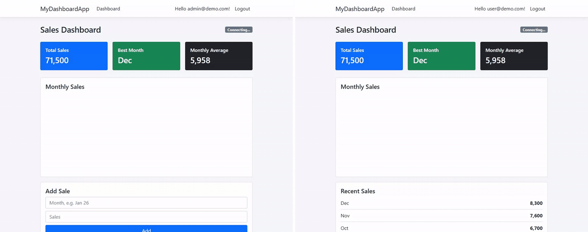
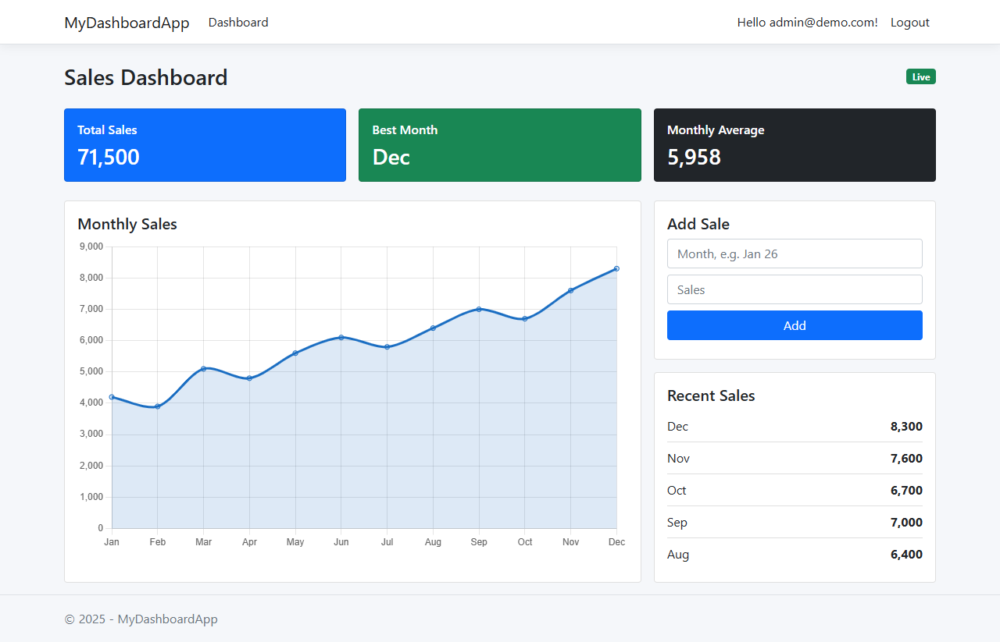
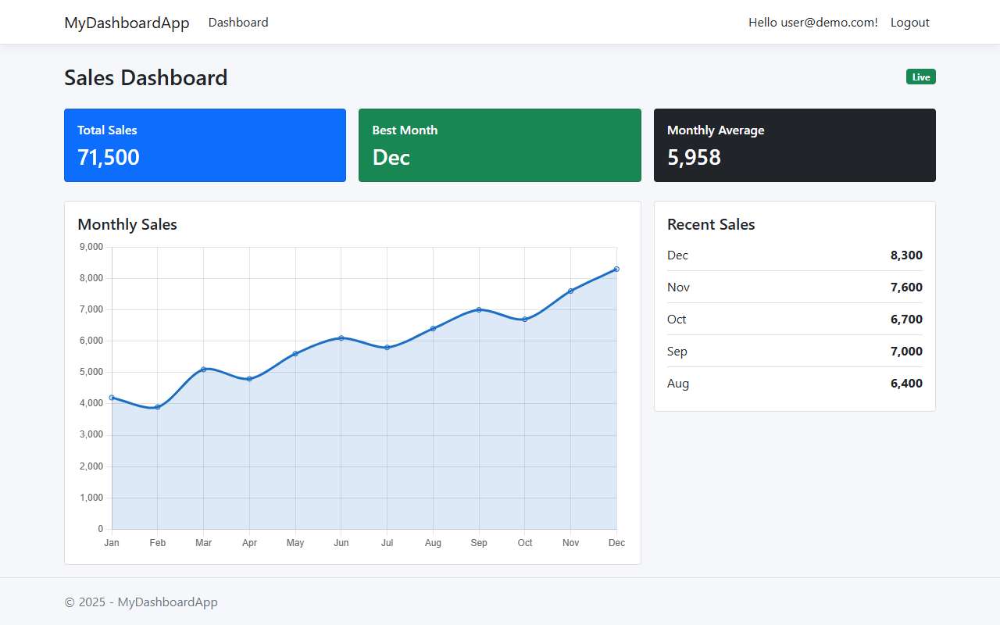
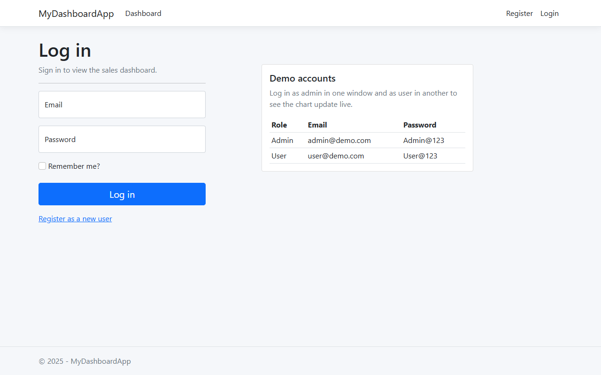
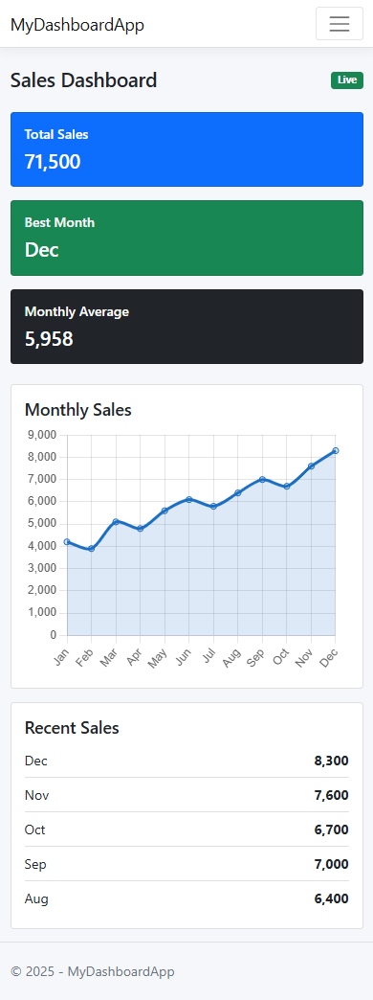

# MyDashboardApp

A small sales dashboard built with ASP.NET Core 8. Admins add monthly sales, and every open dashboard updates instantly through SignalR, with no page refresh.



## What it does

- Sign in with ASP.NET Core Identity. There are two roles, Admin and User.
- The dashboard shows total sales, the best month, the monthly average, a line chart and the five latest entries.
- Only admins see the Add Sale form. The server checks the role as well, so a normal user can't post data even by calling the endpoint directly.
- A new sale is pushed to all connected browsers over SignalR, and the chart and cards update in place.

## Tech stack

- ASP.NET Core 8 MVC, with Razor Pages for the Identity UI
- Entity Framework Core 8 with SQL Server
- ASP.NET Core Identity with role based authorization
- SignalR for real time updates
- Chart.js and Bootstrap 5 on the front end

## Screenshots

| Admin view | User view |
| --- | --- |
|  |  |

| Login | Mobile |
| --- | --- |
|  |  |

## Getting started

You need the [.NET 8 SDK](https://dotnet.microsoft.com/download/dotnet/8.0) and SQL Server. LocalDB, which comes with Visual Studio, is enough.

```bash
git clone https://github.com/zainab-yekta/MyDashboardApp.git
cd MyDashboardApp
dotnet run
```

Open http://localhost:5048. On the first run the app creates the database, applies the migration and adds a year of sample sales, so there is no manual setup.

The default connection string points to LocalDB. To use a full SQL Server instance, change `DefaultConnection` in `appsettings.json`, for example:

```
Server=localhost;Database=MyDashboardApp;Trusted_Connection=True;TrustServerCertificate=True
```

### Demo accounts

These are created in the Development environment from `appsettings.Development.json`.

| Role | Email | Password |
| --- | --- | --- |
| Admin | admin@demo.com | Admin@123 |
| User | user@demo.com | User@123 |

To see the live update, sign in as admin in one browser and as user in a private window, then add a sale.

## Project layout

```
Controllers/HomeController.cs   dashboard page and the AddSale endpoint
Data/                           DbContext and startup seeding
Hubs/ChartHub.cs                SignalR hub the dashboards listen to
Models/                         SalesData entity and the dashboard view model
Views/Home/Index.cshtml         the dashboard
wwwroot/js/dashboard.js         chart, SignalR client and the add sale form
Areas/Identity/                 customized login page
mockup/                         screenshots and the preview GIF
```

## Notes

- Every POST is protected with an antiforgery token through a global filter.
- Failed logins count towards account lockout.
- Chart data is written into the page with `Json.Serialize`, which escapes HTML characters.
